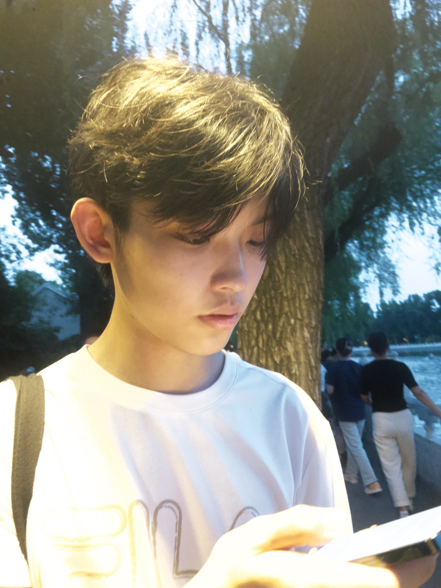

I'm currently a 4th year undergraduate student at USC (University of Southern California) studying mathematics. I'm most interested in algebraic topology, plus its connetions to various fields of mathematics.

There is so much mathematics that I wish to learn more about but haven't found a chance. If you are interested in reading something together, feel free to reach out!

I also have a side interest in theoretical computer science, in particular computational social choice.

In a parallel universe, I might become a painter, a poker player, or a [football manager](https://www.footballmanager.com/).

