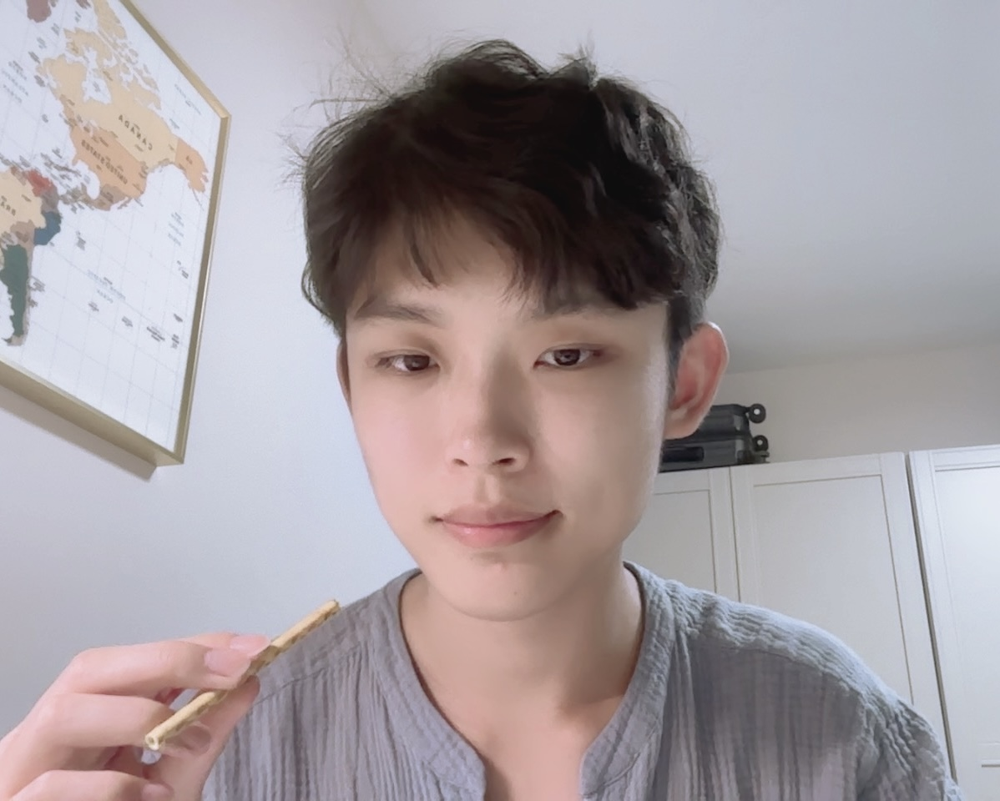

Hi! My name is Jiasen Liu. Starting this October, I'll be a Part III (MASt in Pure Mathematics) student at the University of Cambridge. I recently graduated from the University of Southern California with a B.S. in Mathematics and a minor in Computer Science. My pronouns are he/him/his.

Broadly speaking, I'm interested in how algebraic structures emerge from studying geometric and topological objects. In particular, I'm interested in homotopy theory and its connections to algebraic/arithmetic geometry and representation theory. Currently I focus on learning homological stability and its applications. Over the past few years, I've also spent much time on motivic/equivariant homotopy theory, operads, and infinite loop space theory. I also have a side interest in theoretical computer science, particularly voting theory and computational social choice.

In a parallel universe, I might have become a painter, a poker player, a detective novelist, or a [football manager](https://en.wikipedia.org/wiki/Football_Manager). More recently, I've been reading about the history and theory of feminism.
